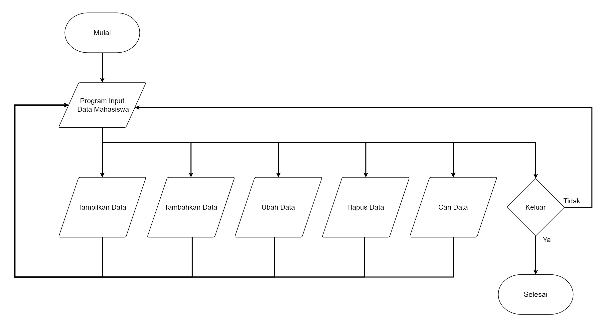
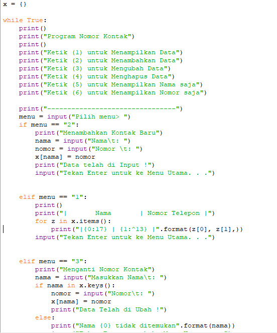
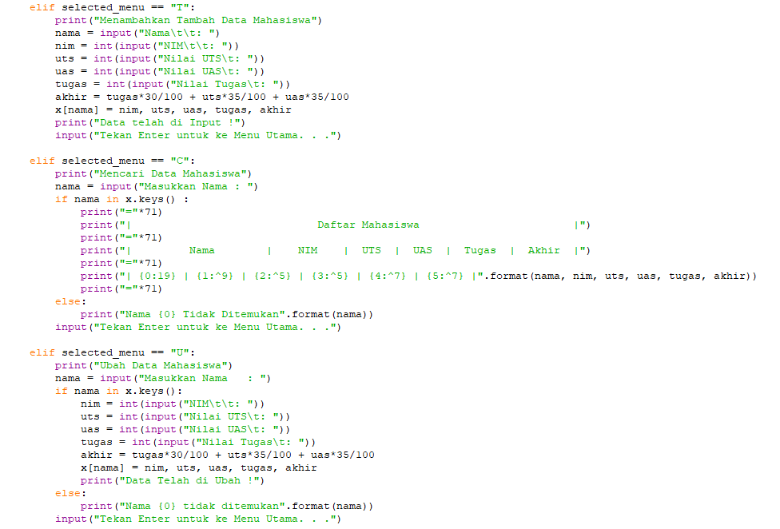
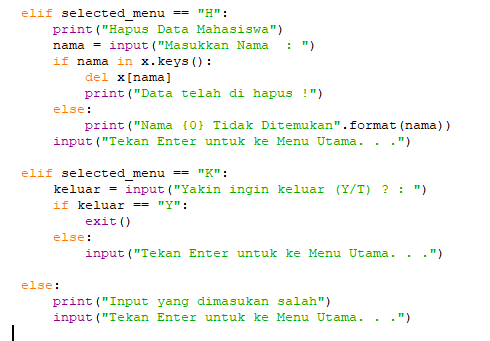
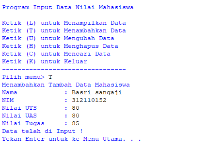
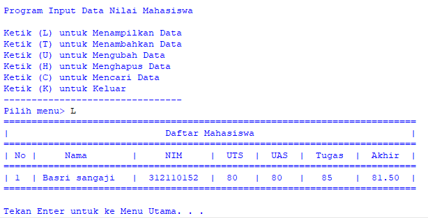
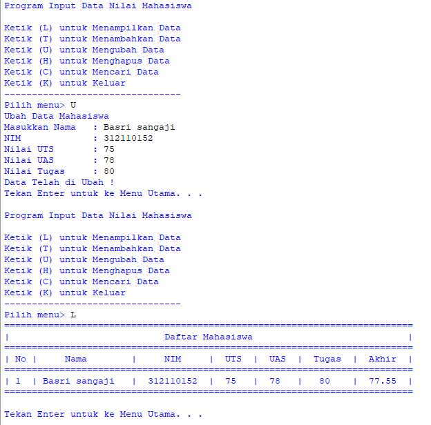
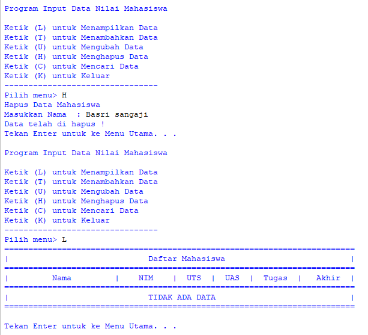
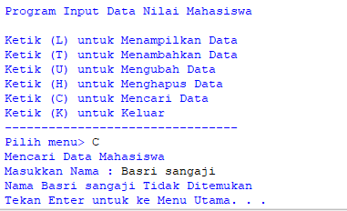

# Praktikum10

Ini adalah flowchart dari program yang akan saya buat.\

Dibawah ini adalah code saya\

Contoh menambahkan data.\

Contoh menampilkan Data.\
Dengan input data diri dan nilai-nilai.\

Contoh mengubah data.\
Dengan input data diri dan nilai-nilai.\

Contoh menghapus data.\

Contoh mencari data.\
